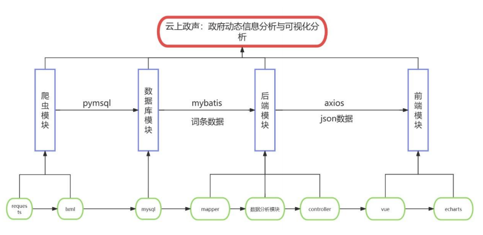
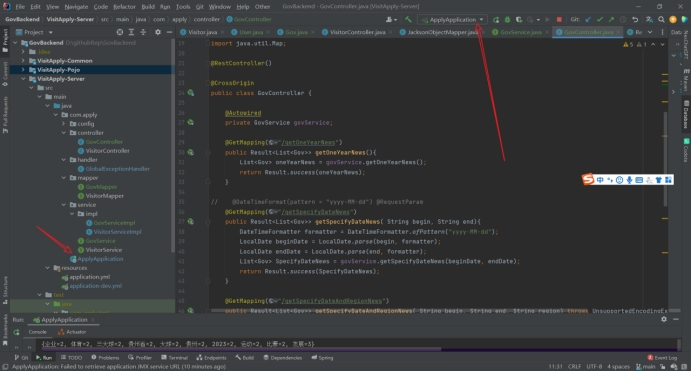
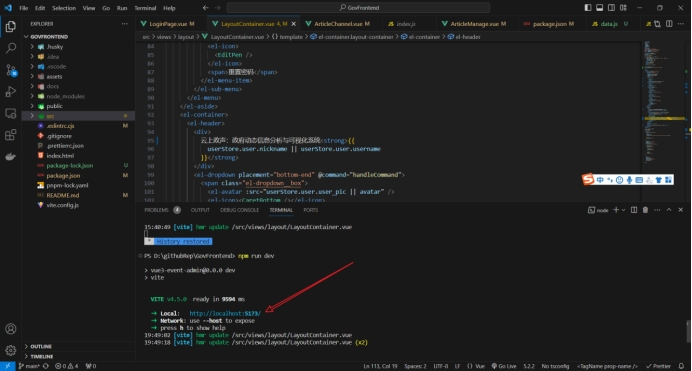
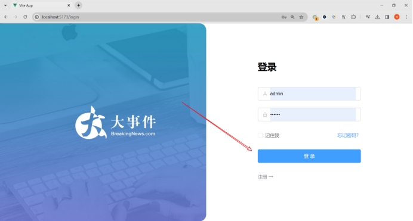
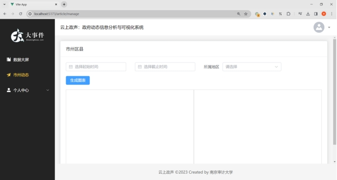
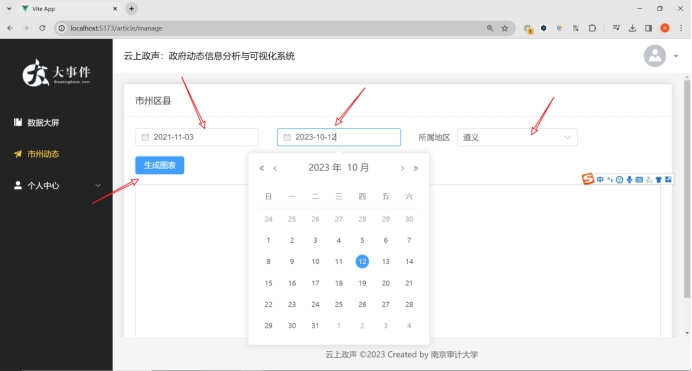
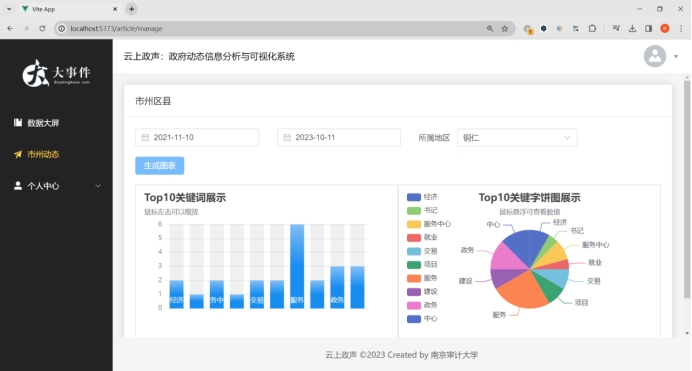
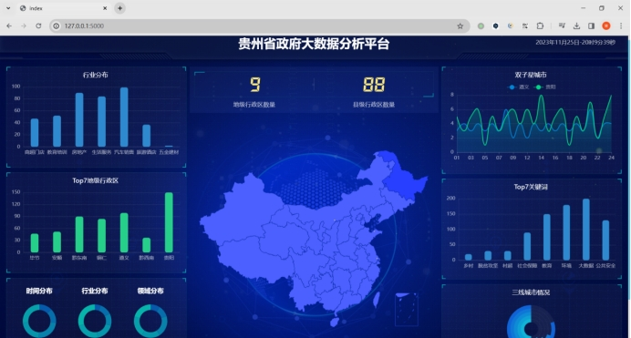

这是我在贵州省大数据中心实习期间所开发的云上政声：政府动态信息分析与可视化系统。这是一款基于前后端分离的政府动态信息分析与可视化系统。整个项目的实现过程分为数据采集、数据存储、数据处理、数据展示四个步骤，通过上述技术实现，可以完成对政府网站信息的自动化采集、存储、处理和展示，从而实现对政府工作的监督和公众参与的促进。

**系统架构：**

1. 启动springboot后端程序

 

 

2. vscode打开前端vue工程，在终端输入npm run dev，启动程序

 

 

3. 进入系统首页，输入用户名：admin，密码：123456，单击登录

 

 

4. 进入市州动态一级菜单下

 

 

5. 输入起始时间、截止时间和所属地区

 

 

6. 单击生成报表，生成Top关键词的柱状图和饼图

 

 

7. 换任意时间段和任意地区，依然可以生成图表

 

 

8. 点击数据大屏进入大数据分析平台可查看行业分布、Top7地级行政区、双子星城市、Top7关键词、三线城市情况

 